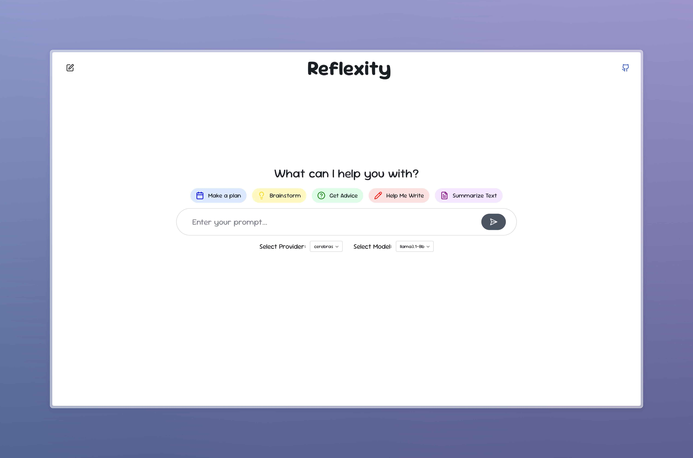
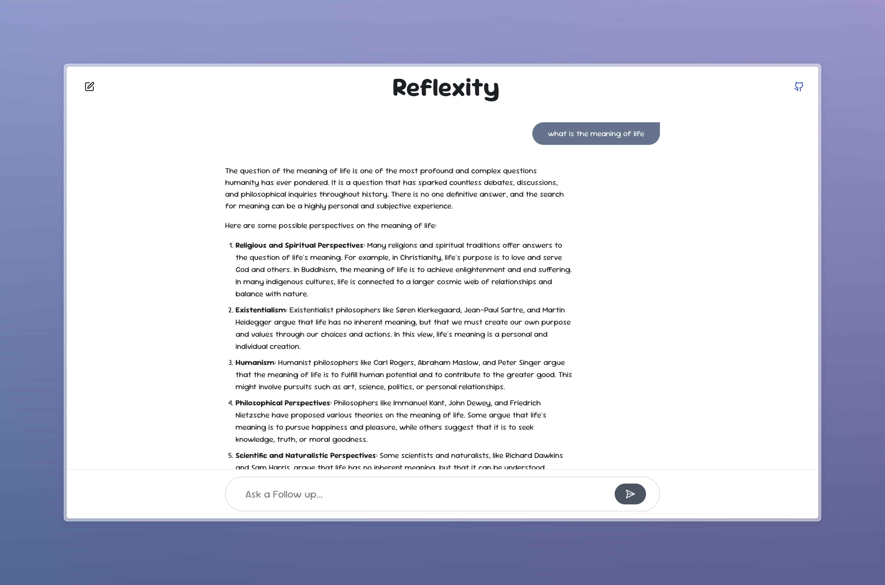

# Reflexity - AI Chat Interface

A modern chat interface built with Reflex that allows you to interact with various AI models through different providers or run completely locally using open-source models.





## Features

- Clean and intuitive chat interface
- Support for multiple AI providers
- Model selection capability
- Chat History powered by Sqlite

## Prerequisites

- python 3.8+
- reflex
- openai

## Installation

1. Clone the repository:
```bash
git clone https://github.com/bm611/chat-ui.git
cd chat-ui
```

2. Set up Python environment with virtualenv:
```bash
python -m venv .venv

# On Unix or MacOS:
source .venv/bin/activate

# On Windows:
.venv\Scripts\activate
```

3. Install required packages:
```bash
pip install -r requirements.txt
```

## Configuration

> [!IMPORTANT]
> Before running the application, make sure to have the necessary API keys from the supported providers. You can add other openai compatible proivders in the below mentioned file.

1. Set the following environment variables for your API keys:
```bash
# On Unix or MacOS:
export CEREBRAS_API_KEY="your_cerebras_api_key"
export HYPERBOLIC_API_KEY="your_anthropic_api_key"
export OPENAI_API_KEY="your_openai_api_key"

# On Windows:
set CEREBRAS_API_KEY=your_cerebras_api_key
set HYPERBOLIC_API_KEY=your_anthropic_api_key
set OPENAI_API_KEY=your_openai_api_key
```

2. Set the required models in `/app/api/api.py' for each of the providers:

```python
ModelProvider.OLLAMA: ModelConfig(
    base_url="http://localhost:11434/v1",
    api_key="ollama",  # required but unused
    available_models=["llama3.1:latest", "llama3.2:1b", "qwen2.5-coder:latest"],
),
```


## Running the Application

1. Run the development server:
```bash
reflex run
```

2. Open your browser and navigate to:
```
http://localhost:3000
```

## Usage

1. Select your preferred AI provider from the dropdown menu
2. Choose the model you want to use
3. Type your prompt in the input field
4. Click the send button
5. Your chat history will be displayed in the conversation view

## Contributing

1. Fork the repository
2. Create your feature branch (`git checkout -b feature/amazing-feature`)
3. Commit your changes (`git commit -m 'Add some amazing feature'`)
4. Push to the branch (`git push origin feature/amazing-feature`)
5. Open a Pull Request

## License

This project is licensed under the MIT License - see the LICENSE file for details

## Acknowledgments

- Built with [Reflex](https://reflex.dev/)
